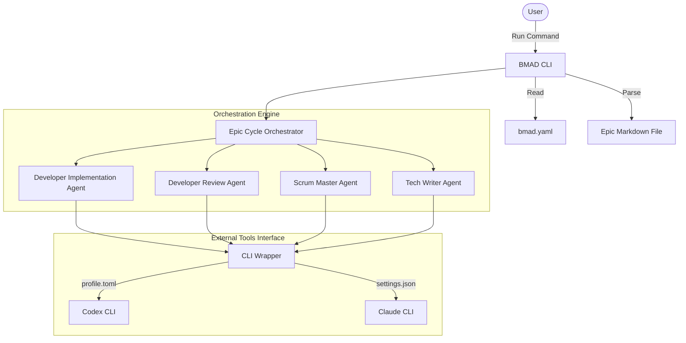
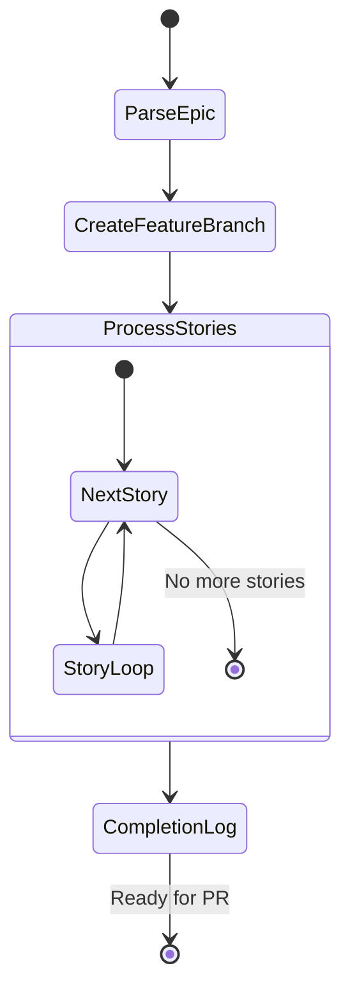
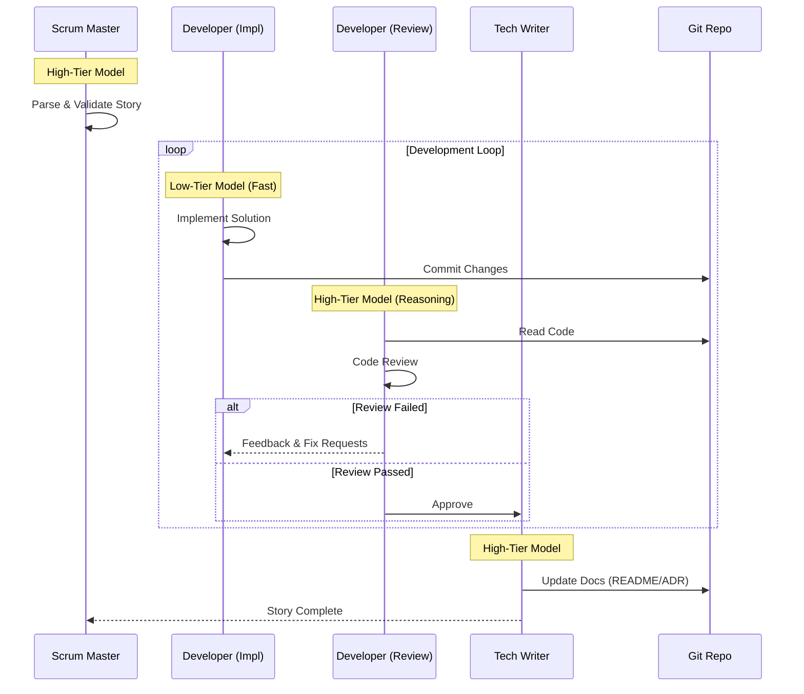

# BMAD Implementation Automation Framework


An automated orchestrator for the **Implementation Phase** of the **BMAD** (Build, Measure, Adapt, Deliver) agile framework. This tool bridges the gap between planning (Epic creation) and delivery (Pull Request) by coordinating specialized AI agents to write code, review it, and document changes.

---

## 🏗️ Architecture

This framework orchestrates a team of AI agents, each with a specific role and configuration, to autonomy execute software development tasks defined in Epic files.

### Core Components



---

## 🔄 Workflows

The system follows a strict hierarchical workflow to ensure quality and consistence.

### 1. The Epic Cycle
Top-level orchestration that turns an Epic file into a ready-to-merge Pull Request.



### 2. The Story Execution Loop
Detailed execution flow for a single story, emphasizing the "Generator-Critic" pattern between Developer and Reviewer.



---

## 🚀 Installation

### Prerequisites
- Python 3.13+
- `uv` (recommended) or `pip`
- `codex` and/or `claude` CLIs installed and authenticated

### Global Installation (Recommended)
Install via `pipx` or `uv tool` to make the `bmad` command available globally.

```bash
# Using uv (fastest)
uv tool install bmad-automation

# Using pipx
pipx install bmad-automation
```

---

## ⚙️ Configuration

The framework uses a **Manifest File** (`bmad.yaml`) in your target repository to map agent roles to specific CLI configurations. This allow you to mix and match models (e.g., cheap models for coding, smart models for reasoning) and tools.

### 1. Create `bmad.yaml`
Place this file in the root of your target repository.

```yaml
# bmad.yaml
agents:
  # HIGH-tier: Planning & Validation
  scrum_master:
    config: ~/.codex/profiles/high.toml
    
  # LOW-tier: Bulk coding (Cheaper/Faster)
  developer_impl:
    config: ~/.codex/profiles/low.toml
    
  # HIGH-tier: Critical analysis & Review
  developer_review:
    config: ~/.claude/settings-review.json
    
  # HIGH-tier: Documentation & Synthesis
  tech_writer:
    config: ~/.codex/profiles/high.toml

git:
  auto_branch: true
  branch_prefix: "feature/"
```

### 2. Configure Your Tools
The framework auto-detects which tool to use based on the config file extension:
- `*.toml` → **Codex CLI**
- `*.json` → **Claude Code CLI**

#### Example: Codex Config (`~/.codex/profiles/low.toml`)
```toml
model = "gpt-4.1-mini"
approval_policy = "on-request"
sandbox_mode = "workspace-write"
model_reasoning_effort = "low"
```

#### Example: Claude Config (`~/.claude/settings-review.json`)
```json
{
  "model": "claude-sonnet-4-5-20250929",
  "permissions": {
    "allow": ["Read(*)", "Bash(git diff:*)"],
    "deny": ["Write(*)", "Bash(rm:*)"]
  }
}
```

---

## 📖 Usage

1.  **Prepare an Epic**: Create a Markdown file describing your feature.
    ```markdown
    # Epic: User Authentication
    
    Implement secure login and registration.
    
    ## Stories
    
    ### Story 1: Login Page
    Create a login form with email and password fields.
    ```

2.  **Run Automation**:
    ```bash
    cd /path/to/your/repo
    bmad-auto epics/user_auth.md
    ```

3.  **Monitor**: The tool will create a branch, iterate through stories, and log progress.

---

## 🛠️ Development

If you want to contribute to the framework itself:

1.  **Clone & Setup**:
    ```bash
    git clone https://github.com/your-org/bmad-automation.git
    cd bmad-automation
    uv sync
    ```

2.  **Run Verification**:
    ```bash
    # Run formatters, linters, and type checkers
    uv run ruff format .
    uv run ruff check .
    uv run pyright src/
    
    # Run tests
    uv run pytest src/
    ```

---

## 📜 License
MIT
