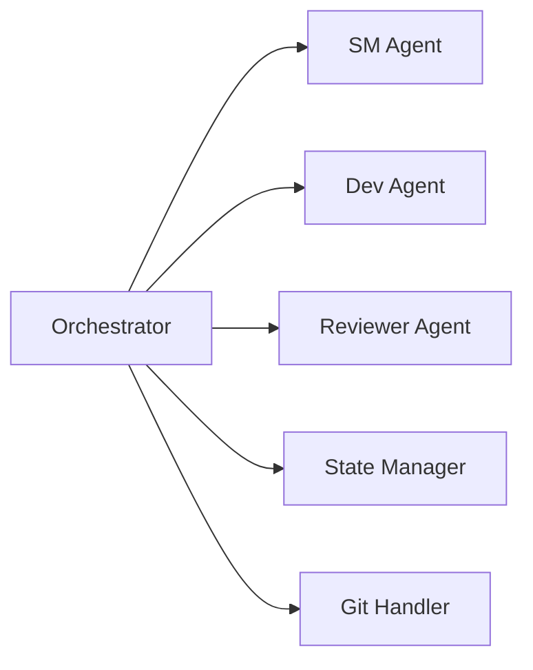
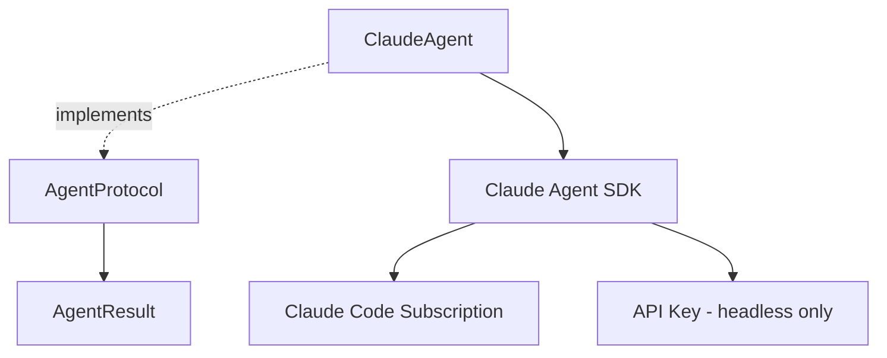
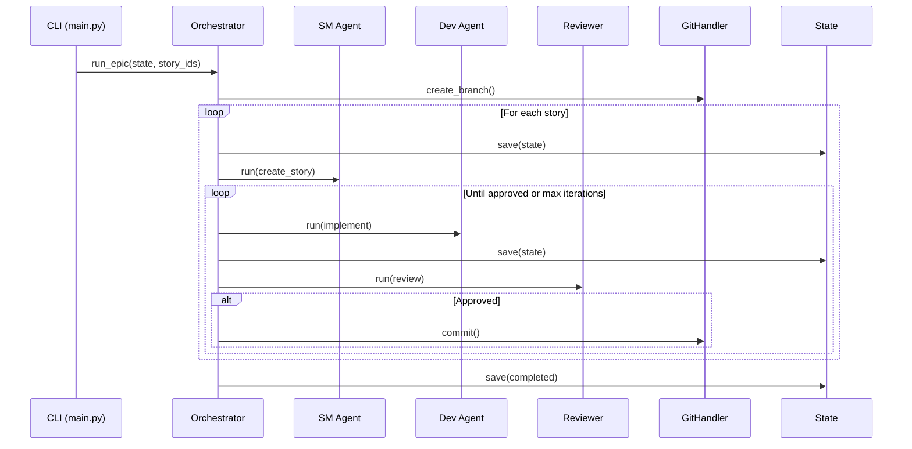

# Architecture Guide

## Overview

bmad-auto follows a **vertical slice architecture** with clear separation of concerns and protocol-based dependency injection.

---

## Architectural Patterns

### 1. Vertical Slice Architecture

Code is organized by feature, with tests co-located:

```
features/
└── git_integration/
    ├── __init__.py
    ├── handler.py      # Implementation
    └── tests/
        └── test_handler.py
```

### 2. Protocol-Based Abstraction

Agents use structural typing via `Protocol`:

```python
@runtime_checkable
class AgentProtocol(Protocol):
    async def run(self, command: str) -> AgentResult:
        ...
```

This enables:
- Easy testing with mock implementations
- Swapping implementations without changing orchestrator
- Clear contracts between components

### 3. Immutable State

All state models use frozen dataclasses:

```python
@dataclass(frozen=True)
class WorkflowState:
    workflow: WorkflowInfo
    current_story: CurrentStory
    stories: StoriesInfo
    error: ErrorInfo | None
```

State transitions create new instances via `replace()`.

### 4. Three-Layer Configuration

| Layer | Source | Purpose | Overlap |
|-------|--------|---------|---------|
| Internal | pydantic_settings | Timeouts, retries | Pre-distribution |
| User | `.bmad-auto.yaml` | Epic path, models, git | Runtime |
| Secrets | `.env` | API keys | Runtime |

**No overlap between layers** - each concern lives in exactly one place.

---

## Component Architecture

### Orchestrator (Owner of Workflow State)



**Responsibilities:**
- Owns workflow state transitions
- Delegates to agents for execution
- Delegates to state.py for I/O
- Saves state after every phase transition

### Agent Layer



**Key Classes:**
- `AgentProtocol` - Interface for all agents
- `AgentResult` - Immutable result with ok/fail factory methods
- `ClaudeAgent` - Claude Agent SDK adapter

**Authentication Modes:**
- `use_logged_in=True` (default): Uses Claude Code subscription credentials
- `api_key` provided: For headless/CI execution only

### State Persistence

```mermaid
flowchart LR
    O[Orchestrator] --> save[save()]
    save --> TEMP[temp file]
    TEMP --> rename[atomic rename]
    rename --> STATE[.bmad-auto-state.yaml]
```

**Atomic Write Pattern:**
```python
temp_path = state_path.with_suffix('.tmp')
temp_path.write_text(yaml.dump(state))
temp_path.rename(state_path)
```

---

## Data Flow

### Story Execution Loop



---

## Error Handling Strategy

### Exception Hierarchy

```
BmadAutoError (base)
├── ConfigError
├── StateCorruptionError
├── AgentError
│   ├── AgentTimeoutError
│   └── AgentExecutionError
└── GitError
```

### Fail-Fast Principle

- Detect invalid state early
- Raise explicit exceptions
- Never use silent fallbacks
- Log errors with context

---

## Key Design Decisions

| Decision | Choice | Rationale |
|----------|--------|-----------|
| Async Runtime | anyio | Matches Claude Agent SDK |
| State Format | YAML | Human-readable, easy debugging |
| Git Operations | subprocess | Simple, no GitPython dependency |
| Agent Invocation | BMAD skill commands | Not raw prompts |
| Test Location | Co-located | Per AGENTS.md vertical slice |

---

## Boundaries

### Orchestrator OWNS
- Workflow state transitions
- Agent context injection
- Phase sequencing (SM → Dev → Review → Git)

### Orchestrator DELEGATES TO
- `agents/` - Agent execution
- `state.py` - YAML file I/O
- `git_integration/` - Git CLI operations

**MUST NOT:** Put file I/O or git commands directly in orchestrator.

---

## References

- [AGENTS.md](../src/AGENTS.md) - Development standards
- [Project Context](../_bmad-output/project-context.md) - bmad-auto specific rules
- [Architecture Decisions](../_bmad-output/architecture/index.md) - Full ADRs
