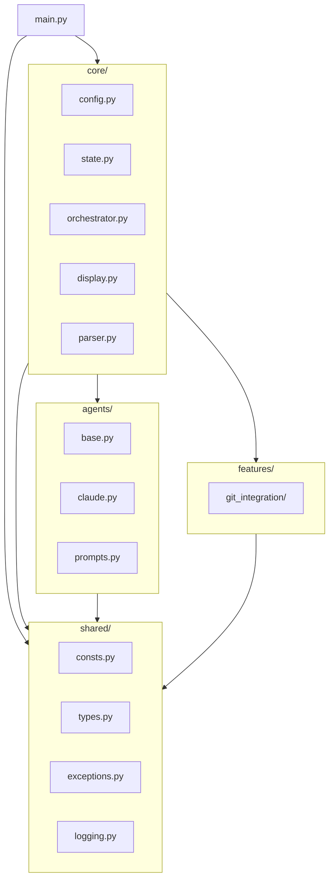

# Source Tree Analysis

## Project Structure

```
coding_workflow/
├── pyproject.toml              # Hatchling build config, dependencies
├── uv.lock                     # Locked dependencies (uv)
├── .python-version             # Python 3.13
├── README.md                   # Project README (needs content)
│
├── src/
│   └── bmad_auto/              # Main package
│       ├── __init__.py         # Package exports
│       ├── main.py             # CLI entry point (Typer app)
│       │
│       ├── shared/             # Shared utilities (cross-cutting)
│       │   ├── __init__.py
│       │   ├── consts.py       # All constants (exit codes, phases, statuses)
│       │   ├── types.py        # Type aliases
│       │   ├── exceptions.py   # Custom exception hierarchy
│       │   ├── error_handling.py
│       │   ├── logging.py      # structlog configuration
│       │   └── tests/          # Co-located tests
│       │
│       ├── core/               # Core business logic
│       │   ├── __init__.py
│       │   ├── config.py       # 3-layer configuration loading
│       │   ├── parser.py       # Epic file parsing
│       │   ├── state.py        # Workflow state model + persistence
│       │   ├── orchestrator.py # SM→Dev→Review loop orchestration
│       │   ├── display.py      # Rich status display
│       │   ├── handoff.py      # Agent context handoff
│       │   └── tests/          # Co-located tests
│       │
│       ├── agents/             # Agent layer
│       │   ├── __init__.py
│       │   ├── base.py         # AgentProtocol + AgentResult
│       │   ├── claude.py       # Claude Agent SDK adapter
│       │   ├── prompts.py      # Prompt/command builders
│       │   ├── factory.py      # Agent factory
│       │   └── tests/          # Co-located tests
│       │
│       ├── features/           # Feature modules (vertical slices)
│       │   ├── __init__.py
│       │   └── git_integration/
│       │       ├── __init__.py
│       │       ├── handler.py  # GitHandler (subprocess wrapper)
│       │       └── tests/
│       │
│       └── tests/              # Top-level test config
│           ├── __init__.py
│           └── conftest.py     # Shared fixtures
│
├── docs/                       # Generated documentation (this folder)
│
└── _bmad-output/               # BMAD planning artifacts
    ├── project-context.md      # AI agent rules
    ├── prd/                    # Product Requirements (sharded)
    ├── architecture/           # Architecture decisions (sharded)
    ├── project-planning-artifacts/
    │   ├── epics/              # Epic files with stories
    │   ├── product-brief-*.md
    │   └── research/
    └── implementation-artifacts/
        ├── sprint-status.yaml  # Sprint tracking
        └── *.md                # Story implementation files
```

---

## Critical Directories

| Directory | Purpose | Key Files |
|-----------|---------|-----------|
| `src/bmad_auto/` | Main package | `main.py` (entry point) |
| `shared/` | Cross-cutting concerns | `consts.py`, `exceptions.py`, `logging.py` |
| `core/` | Business logic | `orchestrator.py`, `state.py`, `config.py` |
| `agents/` | Agent abstraction | `base.py` (Protocol), `claude.py` (adapter) |
| `features/` | Vertical slices | `git_integration/handler.py` |

---

## Entry Points

| Entry | Location | Purpose |
|-------|----------|---------|
| CLI | `main.py:app` | Typer application with run/status/resume commands |
| Package | `__init__.py` | Exports package version |

---

## Module Dependencies



---

## File Counts

| Category | Count |
|----------|-------|
| Python source files | ~25 |
| Test files | ~15 |
| Total lines (estimated) | ~3000 |
| Test coverage target | 80% |
